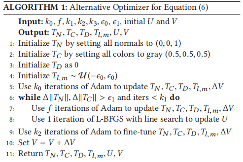

##
### 相关工作
1. UV Parameterization
2. Texture Baking
- 使用技术：raycasting. differentiablr rendering
3. bumping mapping
- 通过像素/纹理扰动丰富几何细节
### 问题描述
1. Texture Mapping
- 低多边形网格M（V，E），通过UV参数化函数ψ映射到平面网格，即$ψ(V)=U$
2. Rasterization Pipeline
- 某一像素的颜色：
$I(p)=filter(shade(d, C_{p}, N_{p}))$
其中filter用于采样p处的颜色，d是view direction，
$C_{p}$是p处的颜色，$N_{p}$是p处的法线
- shading函数：通用，用于渲染：
$shade(d, C_{p}, N_{p}) = (d.N_{p}) * C_{p}$
- 3维点v可以通过rasterization函数得到2维像素坐标p，$p=R(v,d)$，每个屏幕空间像素p可以与输入中的v关联，$v=R^{-1}(p,d)$，则表面颜色可定义为：
$C_{p}=fetch(ψ(R^{-1}(p,d)). T_{C})$，其中$T_{C}$为漫反射纹理，fetch通过插值相邻纹理获取纹理数据，同理，有
$N_{p}=fetch(ψ(R^{-1}(p,d)). T_{N})$，其中$T_{N}$为法线纹理，$ψ$为UV参数化函数
3. Differentiable Rendering
- 将$T_{C}$和$T_{N}$作为以下式子的最小值：
$$
\arg\min_{d \in SO(3)} \int_{S} L_{\text{diff}}(p, d) \, dp
$$
而
$$
L_{diff}(p, d) = I(p, d, T_C, T_N) - I(p, d, \bar{T}_C, \bar{T}_N) \leq 
$$
其中S是屏幕空间，$\bar{T}_C, \bar{T}_N$为真实纹理
### 解决方案
1. Objective function
- 基于$L_{diff}$,联合优化UV坐标U和纹理颜色/法线图$T_{C}, T_{N}$
- 
$$
\min_{T_{C}, T_{N}, U} E_{d \in SO(3)} \left[ L_{\text{diff}} + \lambda_{I\circ UV} E_{d \in SO(3)} [L_{I\circ UV}] \right]
$$
其中$L_{I\circ UV}$协调U的内容
- 乘法的，内容感知的基于图像的对称狄利克雷：
$$
L_{I \circ U_V}(d) \int_M \left( \left| \nabla \psi (v) \right|^2 + \left| \nabla \psi^{-1} (v) \right|^2 \right) L_{\text{diff}} \, dv
$$

其中L_{diff}=0表示不可见的/遮挡的v。
通过与Ldiff相乘，如果表面点v引起更大的视觉差异，L_{I◦UV}会造成更大的失真惩罚：内容感知的UV映射正则化器。

- 
$$
L_{I \circ U_V}(d) \int_M \left( \left| \nabla \psi (v) \right|^2 + \left| \nabla \psi^{-1} (v) \right|^2 \right) \, dv
$$
L_{I◦UV}在内容感知的意义上提高了质量，而L_{uv}确保了ψ的最小基线等距质量
- 确保ψ是双射：
？？？
2.  SH Parallax Mapping
- 
$$
 C(v) = \text{fetch} \, \psi(v) + \frac{ \text{fetch}(\psi(v), T_D)}{{d_{tangent}(z)}} \, ϕ_{SH}(psi (v),d),T_{C}
$$
其中$T_{D}$是scalar depth map（标量深度图）

- 
$$
[ \varphi_{SH}(t, d) = \left( \frac{N}{2} \right) \sum_{l=0}^{N} \sum_{m = -l}^{m = l} \text{fetch}(t, T_{l, m}) Y_{l}^{m}(d) ]
$$
其中t为UV坐标，$Y_{m}$为勒让德多项式，$T_{l,m}$为纹理
3. Vertex Displacements Optimization
- 只应用优化过程后的低聚态的位移$v_{i} ∈ V$ 到 $v{i} +δ_{i}n_{i}$

4. Optimization Technique
- 最终优化公式：
$$
\text{argmin}_{(T_N, T_C, T_D, T_{\ell, m}, \Delta V, U)} L = { E_{D\in \text{SO}(3)}  [L_{\text{diff}}] + \lambda_{\text{uv}} L_{\text{uv}} + \lambda_{I \circ UV} E_{d\in \text{SO}(3)}  [L_{I \circ UV}] + \lambda_{IPC} C_{\text{IPC}} }
$$
- Line-Search Safety Guarantee
- UV and Texture Initialization：使用xatlas 来生成一个初始的双射映射，执行了初始UV参数化的归一化。
- Mesh Normalization：将网格变化在单元格中
- Alternating Optimization：交替更新纹理和UV坐标

固定的迭代次数或纹理变化低于阈值
5. 实现细节
- Texture Padding and Scaling