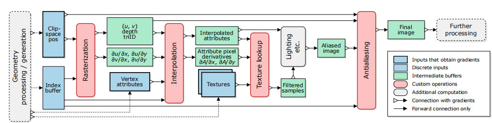

###
#### Intro
- Forward pass: 三维场景到二维
- Backward pass: 给定输出图像的损失，计算相对于输入的梯度
#### DIFFERENTIABLE RENDERING PRIMITIVES
1. 2D图像的问题：每个像素中的可见物体和物体的颜色，在此过程中为使用的所有参数提供梯度，例如，照明和材质参数
2. 
$$
[ I_i = \text{filter}_{(x, y)} ( \text{shade} (M(P(x,y)),lights)(x_{i}, y_{i})) ]
$$
其中$I_{i}$表示像素，$P(x,y)$表示可见世界点，$M(P(x,y))$表示空间因素（纹理，法向），$\text{shade}$表示着色函数，$\text{filter}$表示滤波器（抗锯齿）

3. 几何：$\theta_{G}$，材质：$\theta_{M}$，照明：$\theta_{L}$，projection：$\theta_{C}$
通过求导逐步传递梯度
#### goals
效率，简单，自由，质量
#### design
1. 模块化
2. 位置和纹理均为tensor
3. 所有主要图形api进行的几何和像素处理之间的分离
4. 延迟着色
5. 图像空间的抗锯齿
6. 基本几何原语：三角形

#### Rasterization
- forward pass：输出一个二维样本网络：存储$(I_{D}、𝑢、𝑣、𝑧_{𝑐}/𝑤_{𝑐})$，$I_{D}$指覆盖的三角形，（𝑢、𝑣）是指定沿三角形相对位置的质心坐标
二阶雅各比矩阵$J_{uv}$
- backward pass:
获取后向数据$\frac{\partial L}{\partial (u, v)} $
$$
[ \frac{\partial L}{\partial (x_c, y_c, z_c, w_c)} = \frac{\partial L}{\partial (u, v)} \cdot \frac{\partial (x_c, y_c, z_c, w_c)}{\partial (u, v)} ]
$$
####  Interpolation
- forward pass：对pixel(x,y)，$A_{i}$表示与第i个顶点相关的属性向量，以及由𝑢=𝑢（𝑥，𝑦）和𝑣=𝑣（𝑥，𝑦）生成的重心，插值向量A为$A=uA_{i_{0}} + vA_{i_{1}} + (1 - u - v)A_{i_{2}}$
- backward pass：后向传递的输入为每个像素的梯度$\frac{\partial L}{partial A}$，接下来应用雅各比矩阵即可
#### Texture Mapping
#### Analytic Antialiasing for Visibility Gradients
- 抗锯齿只能在着色之后执行，因此必须作为一个单独的阶段来实现
- 可微
### 分析
#### Texture Filtering